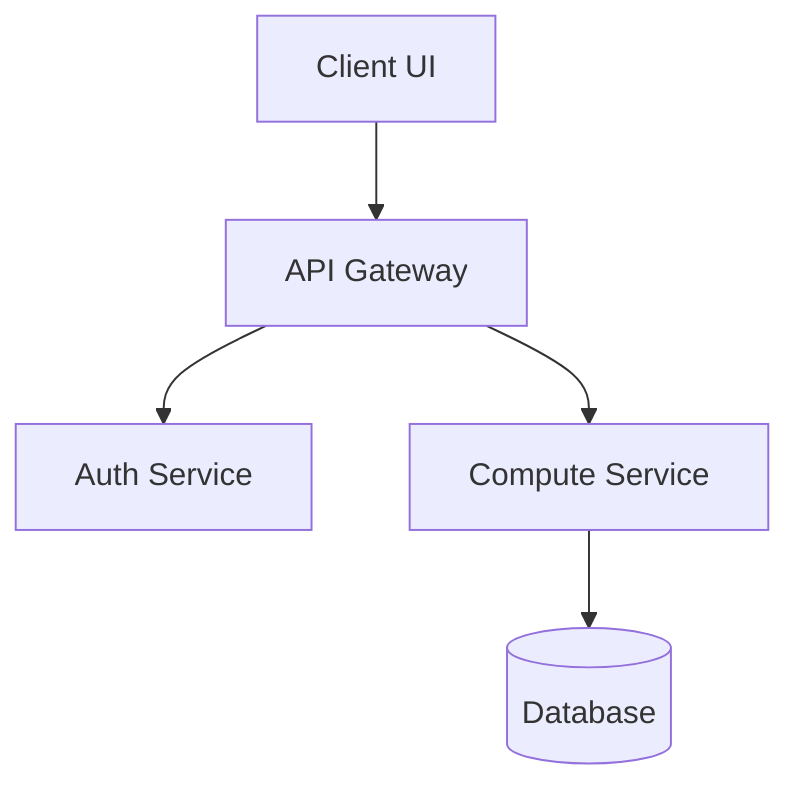
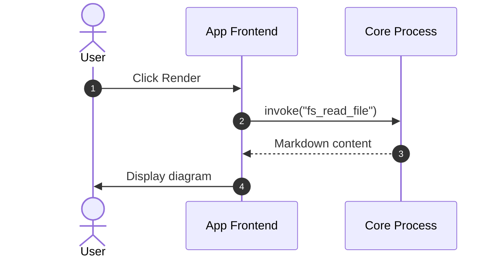
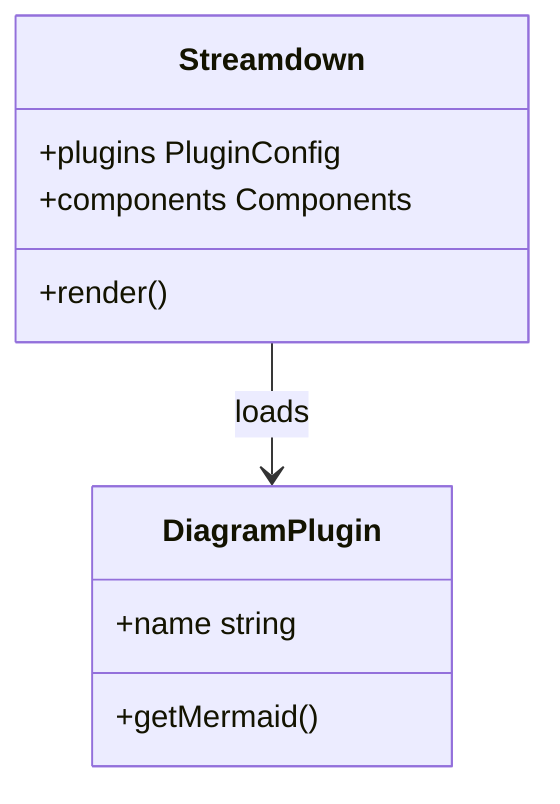

# Markdown Mermaid Preview

This fixture tests rendering of Mermaid diagrams alongside standard markdown and code.

## Flowchart



## Sequence Diagram



## Class Diagram



## Mixed Content with Code and Tables

| Feature | Support | Status |
| :--- | :--- | :--- |
| Flowchart | `graph TD` | Supported |
| Sequence | `sequenceDiagram` | Supported |
| Class | `classDiagram` | Supported |

Standard code block:

```typescript
export function isMermaid(lang: string): boolean {
  return lang === "mermaid";
}
```
