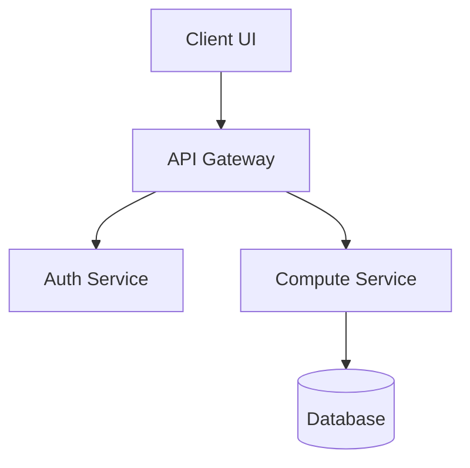
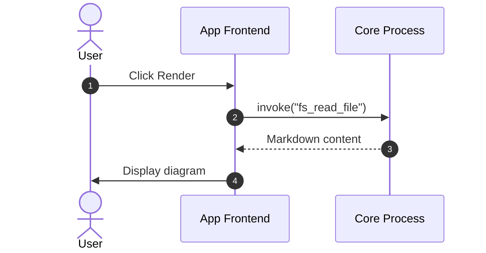
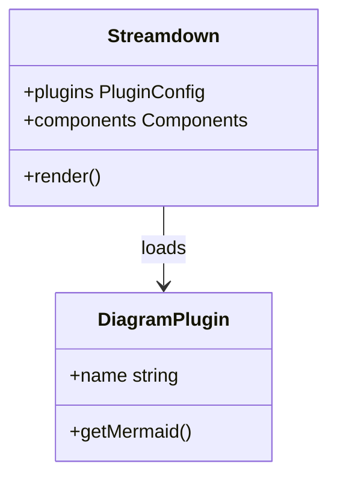
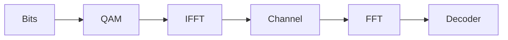

# Markdown Mermaid Preview

This fixture tests rendering of Mermaid diagrams alongside standard markdown and code.

## Flowchart


```mermaid
graph TD
    Client[Client UI] --> Gateway[API Gateway]
    Gateway --> ServiceA[Auth Service]
    Gateway --> ServiceB[Compute Service]
    ServiceB --> DB[(Database)]
```

## Sequence Diagram


```mermaid
sequenceDiagram
    autonumber
    actor User
    participant Frontend as App Frontend
    participant Backend as Core Process
    User->>Frontend: Click Render
    Frontend->>Backend: invoke("fs_read_file")
    Backend-->>Frontend: Markdown content
    Frontend->>User: Display diagram
```

## Class Diagram


```mermaid
classDiagram
    class Streamdown {
        +plugins PluginConfig
        +components Components
        +render()
    }
    class DiagramPlugin {
        +name string
        +getMermaid()
    }
    Streamdown --> DiagramPlugin : loads
```

## Mixed Content with Code and Tables

| Feature | Support | Status |
| :--- | :--- | :--- |
| Flowchart | `graph TD` | Supported |
| Sequence | `sequenceDiagram` | Supported |
| Class | `classDiagram` | Supported |

Standard code block:

```typescript
export function isMermaid(lang: string): boolean {
  return lang === "mermaid";
}
```

## Fullscreen Sizing

Open this horizontal diagram and the vertical flowchart above in fullscreen.
Both must retain every node and label, fit the viewport without stretching,
and remain visible after zoom, reset, close, and reopen.
Repeat in AI Chat with the same fenced Mermaid source on macOS WebKit.


```mermaid
graph LR
    Bits --> QAM --> IFFT --> Channel --> FFT --> Decoder
```
